***1-Yeni bir proje directory'si oluştur.***

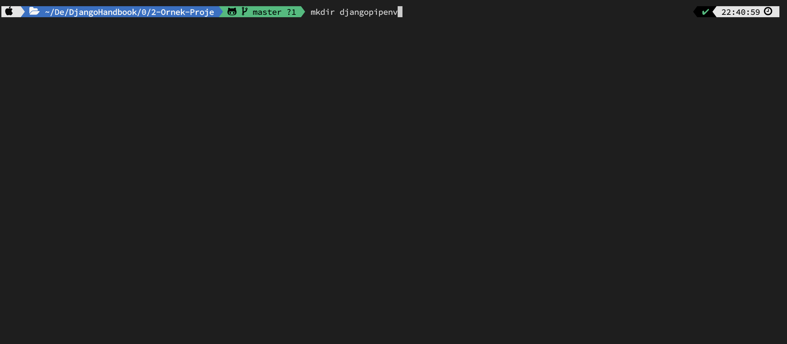

***2-Oluştuğunu kontol et.(macosx="ls", windows="dir")***

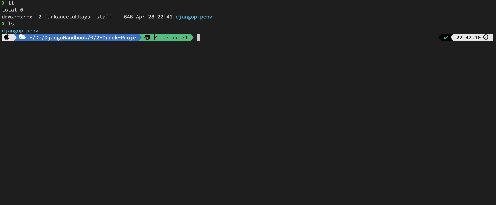

***3-cd change directory bulunduğun directory'i değiştir.***

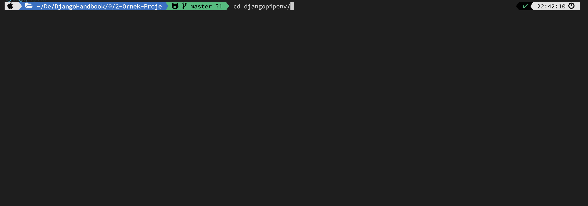

***4-Sadece pipenv install'da yazabilirsiniz. Daha sonra django'yu pip install django diyerek alabilirsiniz. Ama halihazırda direkt djangoyu bu şekilde environment ile beraber kurabiliyorsunuz.***

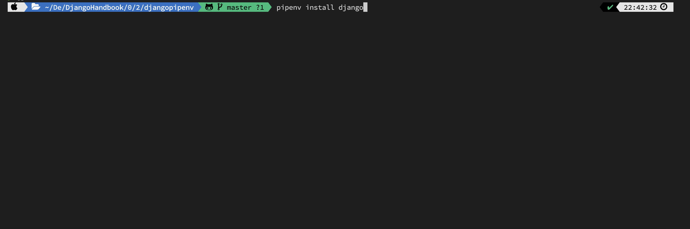

***5-pipenv install yazdığınızda örnek göreceğiniz loglar.Bu arada ana python path'inize pip install pipenv'i kurduğunuzdan emin olun. Onu unutmuşum söylemeyi :D***

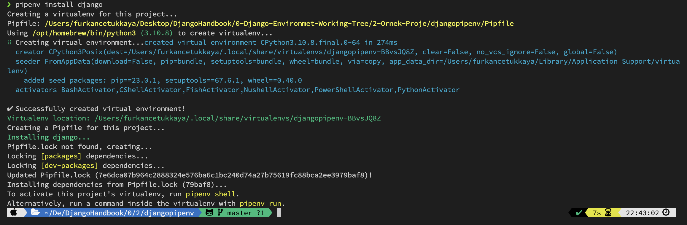

***6-pipenv shell burası source venv/bin/activate komutu ile aynı işi görür.***

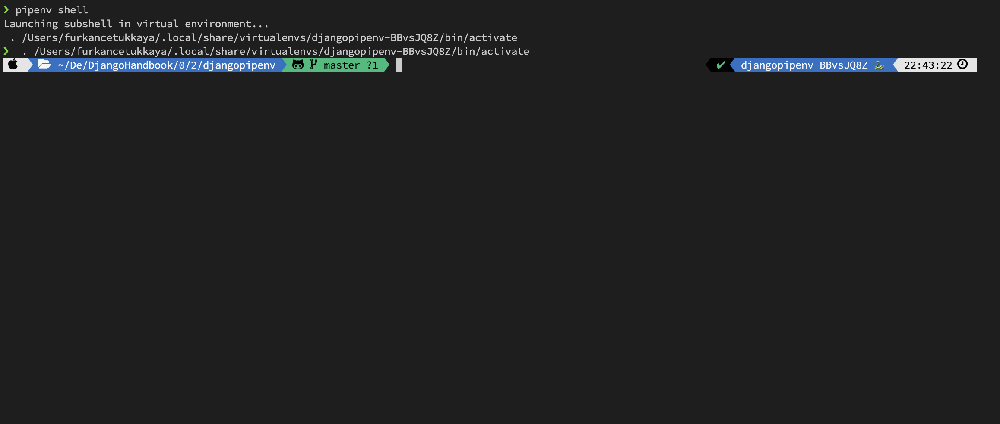

***7-Hemen kontrol edelim istediğimiz paketler inmişmi ona bakalım.***

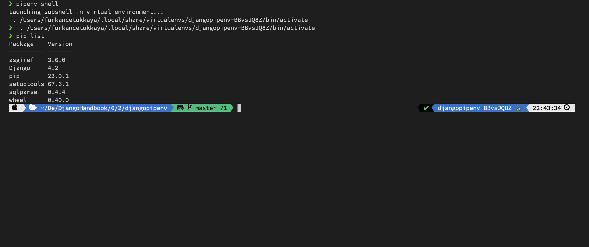

***8-Ana projemizi başlatmak için django-admin komutundan yaralanatak projemizin iskeletini oluştururuz.***

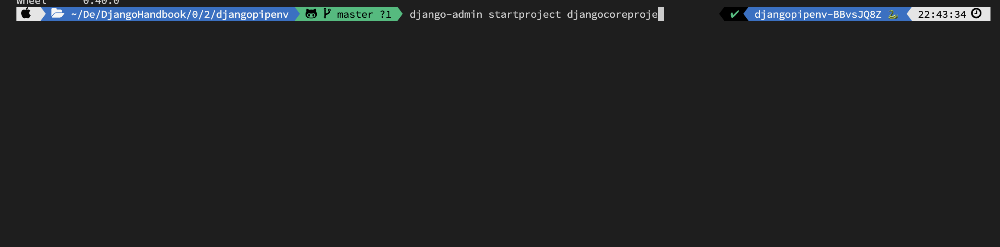

***9-Oluşmuş diye kontrol ediyoruz (macosx="ls", windows="dir").***

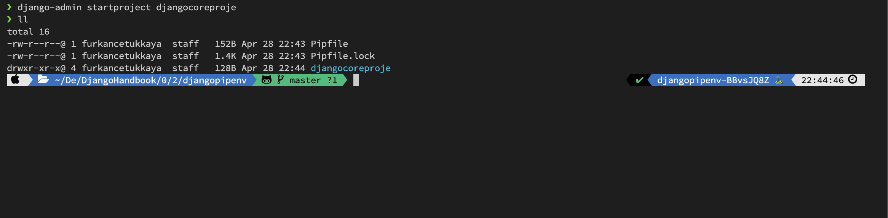

***10-cd ile oluşturdığumuz projenin içine giriyoruz.***

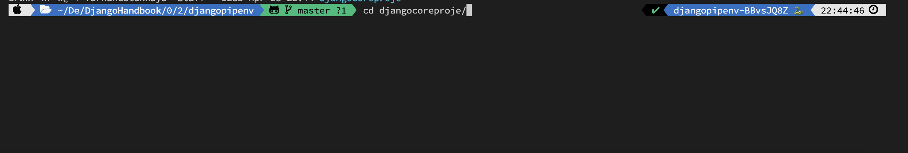

***11-Hangi dosyaları oluşturduğunu kontrol ediyoruz.***

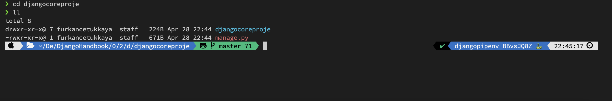

***12-Projenin içinde hangi dosyaları oluşturduğunu kontrol ediyoruz.***

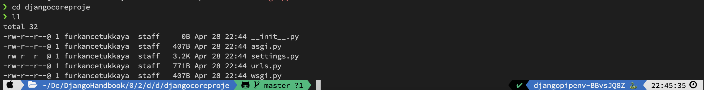

***13-Az önce bulunduğumuz dizinden cd.. ile geri gelebilirsiniz aşağıdaki uygulama yaratma kodunu manage.py'ın olduğu dizinde çalıştırınız.***

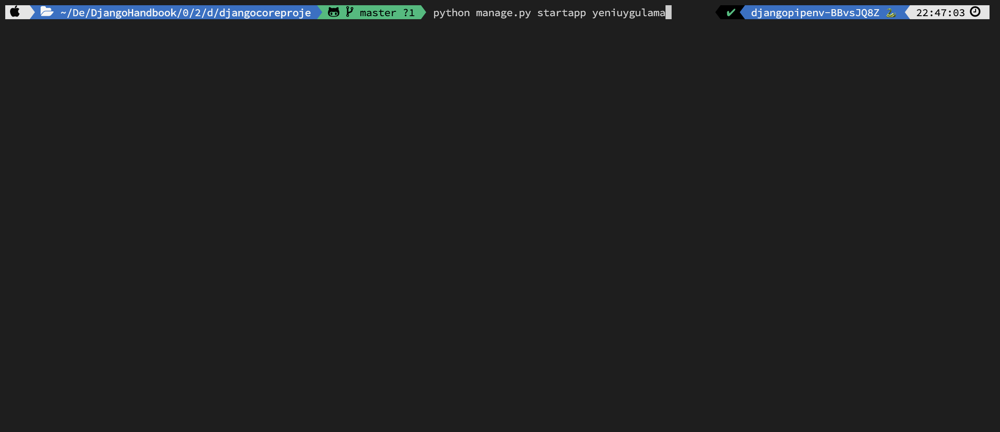

***14-Neler oluşmuş kontrol ediyoruz.***

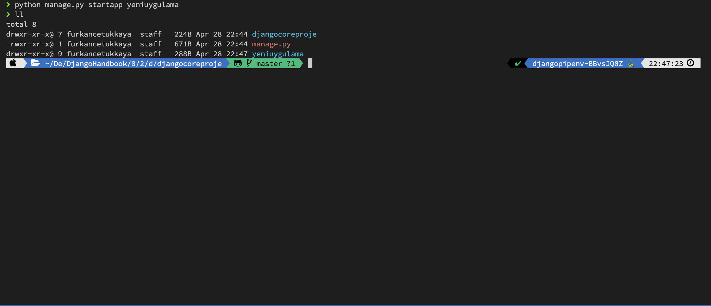

***15-yeniapp'in içinde neler oluşmuş kontrol ediyoruz.***

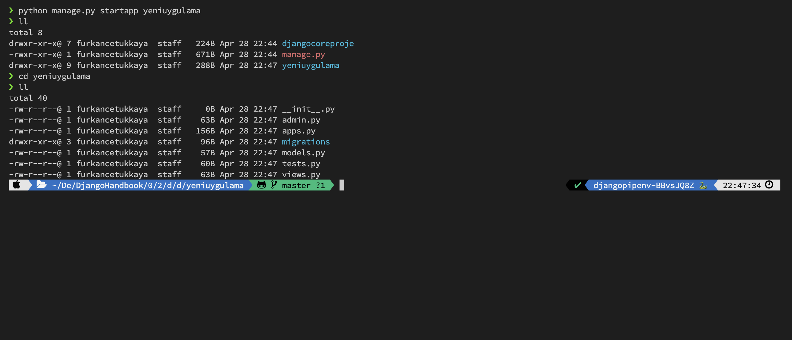

***16-projenin olması gerektiği structure***

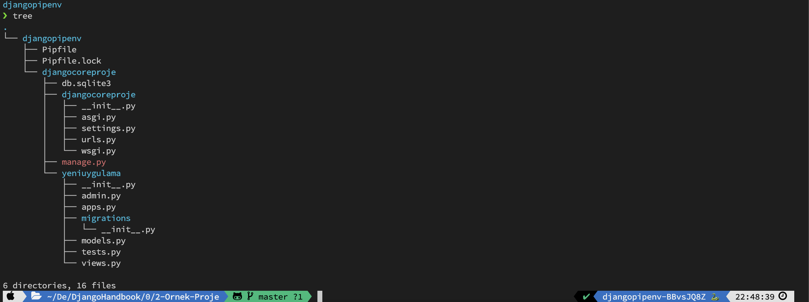