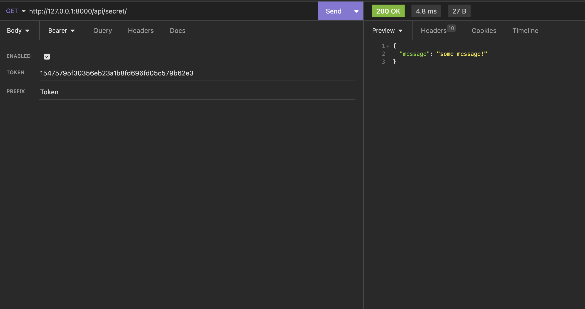
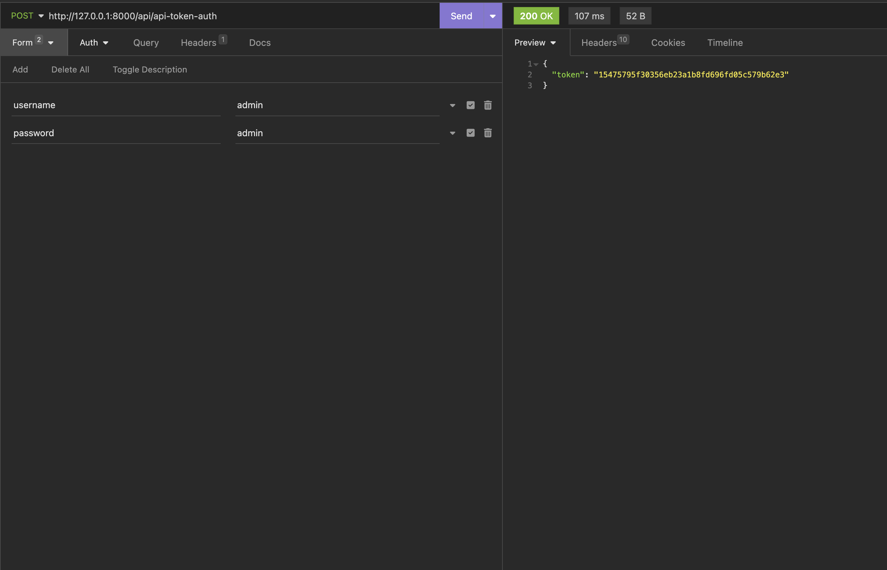

Hedef = Token ile veriye ulaşım. Token'ı post ederk görüntüleme.

        http://127.0.0.1:8000/api/api-token-auth  token yaratma,
        http://127.0.0.1:8000/api/secret/ token ile veriye ulaşma


* views.py

Aşağıdaki eklemeleri yapacağız.

``` python
from rest_framework.decorators import permission_classes
from rest_framework.permissions import IsAuthenticated
```

secret isminde bir fonksiyon oluşturuyoruz.  Yukarıda tanımladığımız kütüphane attribute'larını kullanıyoruz.

Token'siz erişim olması haline hata vermesini bekliyoruz.

``` python
@api_view()
@permission_classes([IsAuthenticated])
def secret(request):
    return Response({"message":"some message!"})
```

* settings.py 

``` python
REST_FRAMEWORK = {
'DEFAULT_AUTHENTICATION_CLASSES': (
    'rest_framework.authentication.TokenAuthentication',
    'rest_framework.authentication.SessionAuthentication',
),
}
```

NOT: Requestleri atarken POSTMAN veya INSOMNIA gibi araçlar üzerinden yollayıznız.

* http://127.0.0.1:8000/api/api-token-auth   (POST)

Form kısmının Url Encoded işaretli olduğuna emin olun.

Admin kullanıcısının credentials'larını girdiğinize emin olun.



* http://127.0.0.1:8000/api/secret/    (GET)

Bearer kısmına az önceki POST request'ten dönen auth-token'ı yazın.

Prefix = Token



docker attach relationcontainer (ctrl+c dediğinizde konteyner'ı stop edecektir boş bir terminal açıp izlemenizde fayda var.)

Uygulamayı çalıştırmak için dockerize etmeniz yeterli

docker build -t authtoken:0.0.1 .

docker run -p 8000:8000 -d --name authcontainer authtoken:0.0.1

Eğer admin tarafından kontol etmek istiyorsak container içinde girip;

Not : Python 3.10.8 versiyonu kullanılmıştır.
